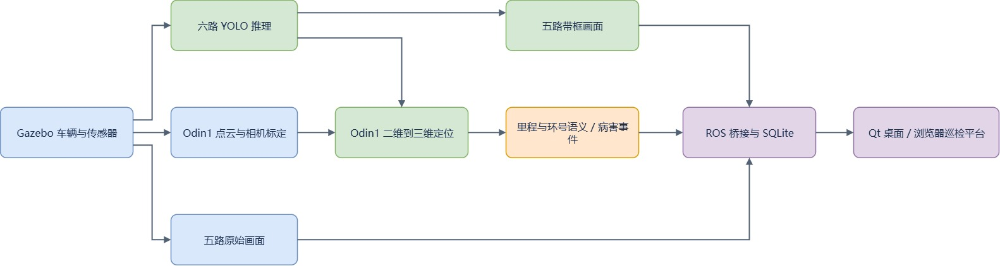
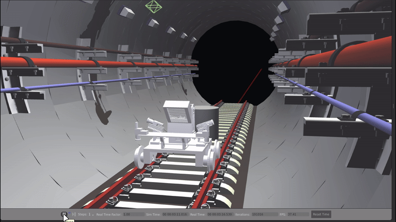

# Metro Inspection

地铁多领域病害综合智能巡检系统，基于 ROS 2 构建轨道巡检车辆仿真、多相机病害检测、激光点云三维定位、隧道工程语义和可视化记录流程。

当前以 **Ubuntu 22.04 + ROS 2 Humble + Gazebo Classic 11 仿真验证**为主。桌面应用可统一管理后台，在 Qt 窗口或浏览器中查看相机、识别结果、病害历史和巡检报告。

## 系统流程



## 目录

- [系统流程](#系统流程)
- [环境与首次部署](#环境与首次部署)
- [快速启动](#快速启动)
  - [桌面应用（推荐）](#桌面应用推荐)
  - [命令行启动完整平台](#命令行启动完整平台)
  - [仿真车辆移动与停车](#仿真车辆移动与停车)
  - [1. 准备控制终端](#1-准备控制终端)
  - [2. 持续向前移动](#2-持续向前移动)
  - [3. 停车与检查](#3-停车与检查)
  - [4.重新回到起点](#4重新回到起点)
- [Tailscale 远程访问](#tailscale-远程访问)
  - [使用前提](#使用前提)
  - [开启访问](#开启访问)
  - [其他常用入口](#其他常用入口)
- [岔轨导航平台](#岔轨导航平台)
- [仓库结构](#仓库结构)
- [文档与运行数据](#文档与运行数据)
- [详细技术方案见技术文档](#详细技术方案见技术文档)

当前启动流程与代码说明见 [项目详细说明](docs/project_details.md)。

## 环境与首次部署

- 系统：Ubuntu 22.04
- 基础环境：ROS 2 Humble、Gazebo Classic 11、Python 3.10、colcon、Git LFS
- 推理：PyTorch、Ultralytics
- 平台：FastAPI、Uvicorn、SQLite、PyQt5 WebEngine

若使用已解压的成果包，进入其中的 `metro-inspection` 目录，跳过下方 Git 安装、克隆及 `git lfs pull` 步骤，从“安装基础工具、桌面、仿真与导航依赖”开始。运行识别时，在桌面运行设置中选择本机的权重文件；新电脑需要重新安装依赖并编译。

```bash
# 安装 Git 与 Git LFS
sudo apt update
sudo apt install -y git git-lfs
git lfs install

# 下载项目与模型资源
git clone --branch feature/simulation https://github.com/x0318/metro-inspection.git
cd metro-inspection
git lfs pull

# 安装基础工具、桌面、仿真与导航依赖
sudo apt install -y \
  python3-colcon-common-extensions python3-rosdep \
  python3-pyqt5.qtwebengine python3-venv fonts-noto-cjk \
  ros-humble-gazebo-ros-pkgs ros-humble-gazebo-ros2-control \
  ros-humble-ros2-controllers ros-humble-robot-localization \
  ros-humble-navigation2 ros-humble-nav2-bringup \
  ros-humble-nav2-collision-monitor liburdfdom-tools

source /opt/ros/humble/setup.bash

# 尚未初始化 rosdep 时执行初始化
if [ ! -f /etc/ros/rosdep/sources.list.d/20-default.list ]; then
  sudo rosdep init
fi

# 安装各模块声明的依赖
rosdep update
rosdep install --from-paths ros_ws/src --ignore-src -r -y --rosdistro humble

# 准备 YOLO 推理环境
bash scripts/setup_yolo_environment.sh

# 数字孪生展示与三维引导模式所需的模型读取和遮挡计算依赖
python3 -m pip install --user 'pycollada>=0.7,<1' 'trimesh>=4.5,<5' 'embreex>=2,<5'

# 统一编译工作空间中的所有包
cd ros_ws
colcon build --symlink-install
source install/setup.bash
```

## 快速启动

### 桌面应用（推荐）

从仓库根目录执行：

```bash
bash scripts/open_inspection_app.sh
```

在“运行设置”中选择本机模型权重，重启就是设置内容。

默认开启识别与三维定位、保持车辆静止，不额外打开 Gazebo GUI 或 RViz。没有权重时可关闭“病害识别”，先检查相机。

Windows 可双击根目录的 `Open Metro Inspection.vbs`

```bash
python3 scripts/install_inspection_shortcut.py
```

### 命令行启动完整平台

从仓库根目录执行，将权重路径替换为本机文件：

```bash
bash scripts/run_inspection_backend.sh \
  yolo_model_path:="/absolute/path/to/inspection_best.pt"
```

此入口默认打开 Gazebo GUI、RViz 和 Qt 页面，车辆不会自动行驶。仅使用浏览器时：

```bash
bash scripts/run_inspection_backend.sh \
  yolo_model_path:="/absolute/path/to/inspection_best.pt" \
  gui:=false rviz:=false qt:=false open_browser:=true
```

平台地址：[http://127.0.0.1:8088](http://127.0.0.1:8088)。停止时使用桌面“停止”按钮或启动终端的 `Ctrl+C`。

### 仿真车辆移动与停车

### 1. 准备控制终端

保留平台运行，在 Ubuntu/WSL 中另开终端：

```bash
cd /home/jo/my-project/metro-inspection
source /opt/ros/humble/setup.bash
source ros_ws/install/setup.bash
export ROS_DOMAIN_ID=70
```

### 2. 持续向前移动

```bash
ros2 topic pub --rate 10 /cmd_vel_raw geometry_msgs/msg/Twist \
  '{linear: {x: 0.2}, angular: {z: 0.0}}'
```

该命令以 10 Hz 持续发送 `0.2 m/s` 前进指令。完整平台的速度链为 `/cmd_vel_raw -> collision_monitor -> /cmd_vel_safe -> watchdog -> /cmd_vel_drive`。

### 3. 停车与检查

先在前进指令终端按 `Ctrl+C` 停止持续发布，再发送零速度：

```bash
ros2 topic pub --once /cmd_vel_raw geometry_msgs/msg/Twist '{}'
```

###  4.重新回到起点

保留平台运行，在 Ubuntu/WSL 中另开终端：

```bash
ros2 topic pub --once /cmd_vel_safe geometry_msgs/msg/Twist '{}'

ros2 service call /pause_physics std_srvs/srv/Empty '{}'
ros2 service call /reset_world std_srvs/srv/Empty '{}'
ros2 service call /unpause_physics std_srvs/srv/Empty '{}'
```

## Tailscale 远程访问

Tailscale 用于让已授权的手机或其他电脑远程访问巡检平台，查看相机画面、病害记录和报告。平台计算仍在运行 ROS 2 的主机上完成，访问端只需要浏览器。

### 使用前提

- 主机与访问端均已安装并登录 Tailscale，处于允许相互访问的 tailnet 中。
- 巡检平台已经启动，本机可以访问 http://127.0.0.1:8088。
- 在能够访问该本地地址的系统中执行 Serve；若后端位于 WSL，而 Tailscale 安装在 Windows，应先确认 Windows 能打开该地址。

安装说明：https://tailscale.com/download

### 开启访问

在运行 Tailscale 的主机终端执行：

```bash
tailscale status
tailscale serve --bg http://127.0.0.1:8088
tailscale serve status
```

### 其他常用入口

下列模式按需选择；启动含仿真的另一种模式前，先停止当前仿真。 

| 用途                             | 从仓库根目录执行                                             |
| -------------------------------- | ------------------------------------------------------------ |
| 不加载 YOLO 的传感器平台         | `bash scripts/run_inspection_backend.sh detection:=false`    |
| 仅启动网页桥接，不启动仿真或识别 | `bash scripts/open_defect_dashboard.sh`                      |
| 查看正在运行的感知链路           | `bash ros_ws/src/metro_sim/scripts/open_subway_v2_perception_rviz.sh` |
| 独立三维建图                     | `bash ros_ws/src/metro_sim/scripts/open_subway_tunnel_v2_mapping.sh` |
| 建图 RViz                        | `bash ros_ws/src/metro_sim/scripts/open_subway_v2_mapping_rviz.sh` |
| 独立岔轨选路与避障测试           | `bash scripts/open_route_choice_platform.sh`               |



建图需额外构建 `metro_pointcloud_mapping`，导航需 Nav2 依赖，具体步骤见详细说明。

独立网页脚本默认订阅 `/simulation/defect_events`；

完整平台默认订阅 `/localized/defect_events`。只打开网页不会产生病害数据。

## 岔轨导航平台

终端执行以下命令，编译导航平台并启动：

```bash
cd /home/jo/my-project/metro-inspection/ros_ws

source /opt/ros/humble/setup.bash

colcon build --symlink-install \
  --packages-select metro_navigation_demo

source install/setup.bash

bash ../scripts/open_route_choice_platform.sh
```

终端运行，在浏览器中打开 [http://127.0.0.1:8090](http://127.0.0.1:8090)


## 仓库结构

```text
metro-inspection/
├── README.md
├── dashboard/                       # Web 页面、样式、脚本及第三方依赖
├── scripts/                         # 桌面、后台、YOLO 和 Windows 启动工具
├── ros_ws/src/
│   ├── metro_bringup/               # 完整平台启动编排
│   ├── metro_description/           # URDF、网格、传感器安装与关节
│   ├── metro_sim/                   # 仿真资源与导航演示脚本目录
│   ├── metro_detection/             # YOLO、覆盖评估与仿真行驶器
│   ├── metro_inspection_interfaces/ # DefectEvent 自定义消息
│   ├── metro_dashboard_bridge/      # ROS 订阅、HTTP API、SQLite、Qt
│   └── metro_mapping/
│       ├── metro_localization/      # 三维定位、事件关联、工程语义、EKF
│       ├── metro_pointcloud_mapping/ # 点云门控、RTAB-Map 集成、PCD 保存
│       └── metro_closed_loop/       # 旧流程适配与相机内参校准
├── docs/                            # 文档导航、详细代码说明与 README 图片
├── configs/                         # 预留的项目级配置目录
├── hardware/                        # 硬件资料目录，当前分支内容有限
└── samples/                         # 预留的示例资料目录
```

## 文档与运行数据

- [项目详细说明](docs/project_details.md)：架构、算法、接口、配置、操作、测试、排障和真机对接。
- [检测模块](ros_ws/src/metro_detection/README.md)、[定位模块](ros_ws/src/metro_mapping/metro_localization/README.md)、[建图模块](ros_ws/src/metro_mapping/metro_pointcloud_mapping/README.md)。
- [仿真与导航](ros_ws/src/metro_sim/README.md)、[桥接与 API](ros_ws/src/metro_dashboard_bridge/README.md)、[事件接口](ros_ws/src/metro_inspection_interfaces/README.md)。

病害数据库默认位于 `~/.local/share/metro-inspection/defects.sqlite3`，每个巡检会话默认最多保留 500 条记录；日志位于 `~/.local/state/metro-inspection/`。

# 详细技术方案见技术文档
