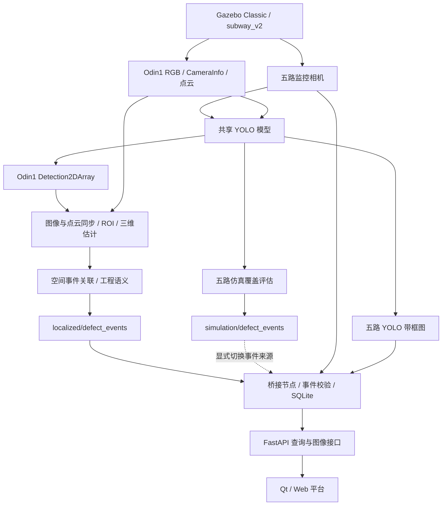
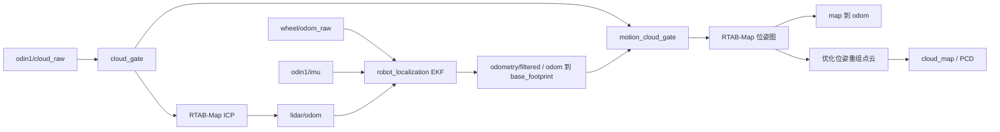

# Metro Inspection 项目详细说明

> 文档基线：2026-09-09 当前工作副本。面向项目成员、部署人员及后续算法与硬件对接人员。本文说明已实现的流程和接口，历史实验结果单独引用，不将设计目标写成已验证指标。

## 目录

1. [项目定位与实现范围](#1-项目定位与实现范围)
2. [系统架构与模块职责](#2-系统架构与模块职责)
3. [车辆模型与传感器](#3-车辆模型与传感器)
4. [二维病害检测与覆盖评估](#4-二维病害检测与覆盖评估)
5. [三维定位与工程语义](#5-三维定位与工程语义)
6. [里程计融合与三维建图](#6-里程计融合与三维建图)
7. [事件接口与平台存储](#7-事件接口与平台存储)
8. [部署与运行操作](#8-部署与运行操作)
9. [配置参数与数据目录](#9-配置参数与数据目录)
10. [导航与速度控制边界](#10-导航与速度控制边界)
11. [验证与故障排查](#11-验证与故障排查)
12. [扩展开发与后续工作](#12-扩展开发与后续工作)

## 1. 项目定位与实现范围

Metro Inspection 面向地铁隧道、轨道及附属结构巡检，将车辆仿真、图像识别、点云定位、工程位置表达和病害记录连接成可运行的软件原型。目标工作流是：采集图像与点云，识别可见病害，为可定位目标估计三维坐标，生成里程和结构区域描述，最后在平台中查询与汇总。

当前重点是仿真环境下的流程验证，包含三个可分别运行的场景：

| 场景 | 内容 | 与完整平台的关系 |
| --- | --- | --- |
| 巡检平台 | 全传感器仿真、六路 YOLO、Odin1 三维定位、事件数据库、Qt/Web | 主入口默认流程 |
| 点云建图 | 无 RGB 相机的轻量仿真、ICP、EKF、RTAB-Map、优化点云保存 | 独立启动，不由主入口自动加载 |
| 导航与停车演示 | 旧 `gazebo_train` 模型、Nav2、障碍守卫、watchdog | 独立实验，不等同于 V6 车辆已完成自主巡检 |

目前可展示图像与病害结果、保存事件、查看历史并打印报告；尚未实现网页任务下发、网页导航控制、病害截图归档或生产级病害等级评定。真机驱动、传感器实测标定与长期稳定性还需要独立验收。

## 2. 系统架构与模块职责

### 2.1 主巡检数据流



`/localized/defect_events` 与 `/simulation/defect_events` 来源不同。桥接节点订阅所配置的一个事件话题，不会默认把两者混合。前者由当前帧点云定位产生；后者是参考位置辅助的仿真评估结果。

### 2.2 模块职责与源码入口

| 模块 | 职责 | 主要入口 |
| --- | --- | --- |
| `metro_bringup` | 组织仿真、检测、定位、桥接、RViz 和 Qt；关键后台退出时结束本次运行 | [inspection_platform.launch.py](../ros_ws/src/metro_bringup/launch/inspection_platform.launch.py) |
| `metro_description` | 车辆 URDF、网格、关节、惯性、碰撞与传感器坐标系 | [subway_v2.urdf](../ros_ws/src/metro_description/urdf/subway_v2.urdf) |
| `metro_sim` | 世界、运行时 SDF、仿真启动、模型处理、速度保护和导航实验 | [scripts](../ros_ws/src/metro_sim/scripts/) |
| `metro_detection` | 共享 YOLO 推理、类别转换、仿真覆盖评估与有限行驶 | [yolo_detector.py](../ros_ws/src/metro_detection/metro_detection/yolo_detector.py) |
| `metro_localization` | 点云投影、病害坐标、空间事件关联、隧道语义与本地 EKF 配置 | [damage_localizer.py](../ros_ws/src/metro_mapping/metro_localization/metro_localization/damage_localizer.py) |
| `metro_pointcloud_mapping` | 点云质量与运动门控、图 SLAM 集成、优化地图保存 | [graph_slam.launch.py](../ros_ws/src/metro_mapping/metro_pointcloud_mapping/launch/graph_slam.launch.py) |
| `metro_closed_loop` | 旧检测定位流程适配、Odin1 相机内参校准；保留占位检测器 | [subway_v2_fusion.launch.py](../ros_ws/src/metro_mapping/metro_closed_loop/launch/subway_v2_fusion.launch.py) |
| `metro_inspection_interfaces` | 模块共享的结构化病害消息 | [DefectEvent.msg](../ros_ws/src/metro_inspection_interfaces/msg/DefectEvent.msg) |
| `metro_dashboard_bridge` | ROS 事件与压缩图像订阅、SQLite、HTTP、桌面运行管理 | [main.py](../ros_ws/src/metro_dashboard_bridge/metro_dashboard_bridge/main.py)、[desktop_app.py](../ros_ws/src/metro_dashboard_bridge/metro_dashboard_bridge/desktop_app.py) |
| `dashboard` | 相机、病害、历史、统计和打印页面 | [index.html](../dashboard/index.html)、[dashboard.js](../dashboard/assets/dashboard.js) |

`metro_mapping` 是多个 ROS 包的父目录；`metro_sim` 是源码资源目录，目前不是独立 colcon 包。根目录 `configs/`、`samples/` 和 `hardware/` 不能替代各模块已有配置与运行模型。

## 3. 车辆模型与传感器

### 3.1 车辆与轨道

当前 `subway_v2` 来源于 V6 CAD 导出模型，包括底盘、四轮、云台、Pitch 组件、Odin1 外壳与固定相机外壳。`metro_description` 保留原始尺度 URDF，仿真运行模型使用约 `3.0063795853269537` 的统一缩放，以匹配隧道轨道尺寸。因此仿真尺寸不能直接作为真机设计尺寸。

四个车轮使用 `libgazebo_ros_diff_drive.so` 驱动，车辆通过轮轨接触前进；当前 V2 模型不使用旧的 `planar_move` 位姿驱动。底盘正前方为 `base_footprint` 的 `+X`，正 `linear.x` 对应前进。

Pitch 关节范围为 `-15°` 至 `+45°`，默认启动角为 `+45°`，此时光轴朝前上方约 `30°`。角度指令与光轴仰角不是同一概念，`-15°` 对应朝向拱顶。Yaw 保持锁定。相机外参中仍包含仿真可见性修正，后续真机必须使用实测标定。

### 3.2 相机与点云接口

| 数据源 | 原始输入话题 | 用途 |
| --- | --- | --- |
| XJ1～XJ4 | `/subway_v2/xj1/image_raw` 至 `/subway_v2/xj4/image_raw` | 五路平台监控中的四路、YOLO、仿真覆盖评估 |
| Pitch | `/subway_v2/pitch_camera/image_raw` | 云台图像监控、YOLO、仿真覆盖评估 |
| Odin1 RGB | `/odin1/rgb/image_raw` | 第六路 YOLO，供三维定位使用 |
| Odin1 相机内参 | `/odin1/rgb/camera_info` | 点云向图像投影 |
| Odin1 点云 | `/odin1/cloud_raw` | 病害定位和独立建图 |
| Odin1 IMU | `/odin1/imu` | 本地里程计融合 |
| 轮式里程计 | `/wheel/odom_raw` | EKF 输入、仿真覆盖位置与行驶状态 |

原始图像为 `sensor_msgs/msg/Image`，平台订阅对应的 `image_raw/compressed`，类型为 `sensor_msgs/msg/CompressedImage`。点云、IMU 和里程计分别为 `PointCloud2`、`Imu` 和 `Odometry`。

检测端 Pitch 的逻辑名为 `pitch`，平台原图 ID 为 `pitch_camera`，其带框画面 ID 为 `yolo_pitch_camera`。Odin1 事件可能出现在病害列表，但 Odin1 画面不属于平台默认五路监控布局。

## 4. 二维病害检测与覆盖评估

### 4.1 YOLO 推理

`yolo_detector` 使用一个共享模型处理配置的多路图像，分别限制每路处理频率，并避免排队处理过时图像。模型输出转换为 `vision_msgs/msg/Detection2DArray`，图像时间戳和光学坐标系传递到检测消息中，以便后续同步。

完整平台各路结果为 `/damage_detections/{xj1,xj2,xj3,xj4,pitch,odin1}`。带框图话题为 `/damage_detection/<camera>/annotated_image` 及其 `/compressed` 版本。单相机配置 `yolov8_sim.yaml` 则默认输出 `/damage_detections`，不要混用两种启动配置的话题名。

完整平台使用 [yolov8_coverage.yaml](../ros_ws/src/metro_detection/config/yolov8_coverage.yaml)，主要默认值如下：

| 参数 | 默认值 | 含义 |
| --- | --- | --- |
| `confidence_threshold` | `0.35` | 检测置信度阈值 |
| `iou_threshold` | `0.45` | 重叠框抑制阈值 |
| `image_size` | `640` | 模型推理图像尺寸设置 |
| `max_inference_rate_hz` | `3.0` | 每路推理频率上限，不是实测帧率保证 |
| `device` | `auto` | 自动选择推理设备，可改为 CPU 或 CUDA 索引 |
| `fallback_to_cpu` | `true` | GPU 推理出现受支持的失败情况时允许回退 CPU |
| `image_reliability` | `reliable` | 适配 Gazebo 按订阅需求启用的相机发布 |
| `annotated_jpeg_quality` | `75` | YOLO 压缩输出质量，区别于平台二次预览质量 |

启动脚本先等待六路相机实际收到图像，再启动检测。`/yolo/ready` 在所有已配置相机至少完成一次推理后置为真；这是运行就绪信号，不代表模型已经识别到病害。

### 4.2 类别约定与模型边界

| 中文类别 | ROS 稳定标识 |
| --- | --- |
| 裂缝 | `crack` |
| 渗漏水 | `water_leakage` |
| 管片破损掉块 | `segment_damage` |
| 扣件断裂 | `fastener_broken` |
| 扣件缺失 | `fastener_missing` |
| 扣件松动歪斜 | `fastener_loose` |
| 管线支架松脱 | `bracket_loose` |
| 异物入侵 | `foreign_object` |

这八类是接口归一化规则，实际可检类别由加载权重的训练内容决定。ROS 消息保留英文标识，带框图片使用 ASCII 拼音标签，平台提供中文显示。显示用拼音不应进入下游事件类别。

权重不随仓库分发；部分脚本保留开发机默认路径 `/home/jo/incoming/yolov8n_sim_demo_best(1).pt`，部署时必须显式选择本机文件。`yolov8` 文件名是现有流程命名，不能仅凭命名判断实际权重架构或检测效果。

### 4.3 十处参考病害覆盖评估

评估器使用五路监控相机的真实 YOLO 框、车辆里程计和相机纵向偏移，将观察结果匹配到十处已知仿真参考点。参考位置为 `1.8、6.6、9.0、10.2、13.8、16.51、18.6、23.4、28.2、30.6 m`，匹配容差为 `0.9 m`，每个参考点需三次不同源图像时间戳的命中确认。

参考位置不生成检测框，但会辅助匹配和事件位置表达。因此输出标记为 `truth_assisted`，通过 `/simulation/defect_coverage` 和 `/simulation/defect_events` 发布。覆盖达到 10/10 不能等同于 mAP、召回率、误检率或独立三维定位精度达标。

有限行驶器默认设置为 `0.2 m/s`、目标 `x=31 m`、超时 `240 s`，满足覆盖完成、目标位置或退出条件后停止。完整平台默认关闭自动行驶；专用 `open_subway_tunnel_v2_yolo_coverage.sh` 则默认开启，使用前需确认运行的是仿真场景。

## 5. 三维定位与工程语义

### 5.1 坐标估计流程

完整平台将定位输入覆盖为 Odin1 的图像、CameraInfo、点云和 `/damage_detections/odin1`。当前仅使用这一路，是因为它具备已配置的相机与雷达变换及重叠视场。

1. 近似同步图像、点云和二维检测，完整平台时间容差为 `0.12 s`。
2. 提取有限 XYZ 点，通过 TF 转换到相机光学坐标系。
3. 使用 CameraInfo 内参投影，剔除相机后方和图像范围外的点。
4. 对每个检测独立选取框内 ROI 点；主入口关闭掩膜，使用 bbox，默认 ROI 缩放为 `0.90`。
5. 以 DBSCAN 选择主要密集簇，再取 XYZ 中位数；也支持 MAD 深度异常值剔除与中位数估计。
6. 将估计点变换到 `odom`，关联历史空间事件，确认后生成 `DefectEvent`。

忽略 skew 时，针孔投影为 `u = fx * X / Z + cx`、`v = fy * Y / Z + cy`；代码也处理 CameraInfo 中的 skew 项。正确内参、相机光学坐标定义和外参是这一公式成立的前提。

默认至少需要 3 个 ROI 点，DBSCAN 邻域为 `0.15 m`、最小样本数为 3。无有效簇时实现会退回候选点中位数，所以获得坐标并不自动证明该坐标位于病害实际可见表面。需要结合调试图检查目标、投影点和背景几何。

每个同步帧只转换和投影一次点云，再为各目标选点；单个目标失败不会阻断其他目标。调试输出包括：

| 话题 | 类型 | 内容 |
| --- | --- | --- |
| `/damage_point_camera` | `geometry_msgs/msg/PointStamped` | 相机坐标系下估计点 |
| `/damage_point_global` | `geometry_msgs/msg/PointStamped` | 全局配置坐标系下的点，当前默认 `odom` |
| `/localization/debug_projection` | `sensor_msgs/msg/Image` | 检测框、投影点、估计与状态 |
| `/localization/estimated_marker` | `visualization_msgs/msg/Marker` | RViz 点与文本标记，按不同 ID 分别发布 |
| `/localized/defect_events` | `metro_inspection_interfaces/msg/DefectEvent` | 确认后的病害事件 |

### 5.2 多帧关联与去重

同类别三维观察在 `0.5 m` 范围内进行一对一批量关联，优先最大化匹配数，再最小化总距离。每条轨迹每帧最多增加一次命中，累计三个不同时间戳的观察后才接受新事件。重复或倒序的检测帧被忽略。

事件 ID 使用 `camera_name-<UUID4>`，后续观察沿用该 ID 更新同一事件。UUID 避免节点重启后覆盖同一会话的旧记录，但轨迹不跨进程恢复：重启后再次看到同一处物理病害，仍可能生成新记录。仿真时钟重置后应重启定位节点；跨运行关联还需要核对地图或 odom 原点、时间基准和工程标定。

定位置信度是根据候选点和内点数量计算的启发式质量值，不是经过标定的定位正确概率。当前事件的工程等级设为 `SEVERITY_UNKNOWN`，截图 URI 为空。

### 5.3 里程、环号与时钟方位

[semantic_geometry.py](../ros_ws/src/metro_mapping/metro_localization/metro_localization/semantic_geometry.py) 根据轴向坐标和断面中心计算报告字段。默认沿 `+X`，起始里程 `12000 m`、起始环号 `1000`、环长 `1.2 m`，断面中心为 `y=0、z=1.75 m`。

```text
相对里程 d = chainage_sign × 指定轴坐标
绝对里程 s = chainage_start_m + d
环索引 n = floor(d / segment_length_m)
环号 = segment_start_id + n
环内偏移 = d - n × segment_length_m
时钟方位 = (atan2(-(y-y0), z-z0) 转角度并归一到 [0,360)) / 30
```

例如默认参数下 `x=10.2 m` 对应 `K12+010.200`、环号 `1008`、环内偏移约 `0.6 m`。顶部为 0 点（12 点），右侧约 3 点，底部约 6 点，左侧约 9 点；结果还分为拱顶、左右边墙及底部区域。

这些字段当前明确标为“仿真环号”。算法是直线轴向映射，未实现真实线路曲线里程投影、测量控制网或变环宽管理；不能直接作为实际地铁线路的测量成果。

## 6. 里程计融合与三维建图

### 6.1 TF 与里程计归属



基础传感器模式融合轮速前向速度、轮速偏航角速度和 IMU 偏航角速度。当前模拟 IMU 的姿态协方差为零，基础配置不融合绝对 IMU 姿态。图建图模式进一步启用 `/lidar/odom` 的相对起点位姿输入。

TF 必须保持单一发布者：`odom -> base_footprint` 属于 EKF，`map -> odom` 属于 RTAB-Map，ICP 不发布 TF，Gazebo 差速插件关闭里程计 TF 发布。完整巡检平台默认使用本地 `odom` 定位；启用图 SLAM 不会自动把既有病害事件转换为优化后的 `map` 坐标。

### 6.2 点云处理与地图输出

| 步骤 | 作用 | 当前主要默认值 |
| --- | --- | --- |
| `cloud_gate` | 去除空、稀疏、格式错误和倒序帧 | 至少 5000 点，针对当前仿真数据 |
| ICP | 局部扫描匹配，使用 EKF 变换提供运动初值 | 输入 `/mapping/cloud_valid` |
| `motion_cloud_gate` | 依据运动触发关键帧，减少静止时重复建图 | 平移 `0.35 m` 或旋转 `0.10 rad` |
| RTAB-Map | 关键帧、顺序约束、空间邻近约束和图优化 | 关键帧扫描按 `0.05 m` 体素化 |
| `map_data_gate` | 抑制稳定图中只改变临时节点的重复消息 | 稳定位姿/关键帧变化时放行 |
| 地图拼接与保存 | 使用优化后位姿重组历史点云，导出 PCD | `/mapping/cloud_map`、`/mapping/save_map` |

ICP 失配时不发布无效里程计，EKF 可继续使用轮速和 IMU。独立建图启动默认使用无相机模型以降低仿真负担。旧 `accumulated_map.launch.py` 保留有界体素累计流程，但不包含 ICP、图优化或回环，不能用来验证历史点云的全局纠偏。

默认输出为 `results/maps/subway_v2_optimized.pcd` 和 `results/maps/subway_v2_rtabmap.db`。PCD 用于查看最终点云，数据库保存关键帧、约束和图状态。默认启动会重置建图数据库；续建必须显式设置 `SUBWAY_MAPPING_RESET_DATABASE=false`，需要保留的旧结果应先备份或更换输出路径。

回环必须来自实际重访旧区域。现有检查默认要求至少一条空间回环边、一条相对位移不超过 `0.5 m` 的重访边，以及至少 `5 m` 的轨迹范围。单向行驶只能说明数据流连通，重复隧道结构还可能产生错误匹配，需结合轨迹检查。

## 7. 事件接口与平台存储

### 7.1 DefectEvent 消息

消息定义见 [DefectEvent.msg](../ros_ws/src/metro_inspection_interfaces/msg/DefectEvent.msg)。它将二维检测、三维定位和工程语义放在一个结构化接口中，处理节点需填写本阶段已知字段。

| 字段组 | 字段 | 约定 |
| --- | --- | --- |
| 来源与身份 | `header`、`event_id`、`detection_id`、`camera_name` | 图像时间戳、相机光学坐标系、稳定事件 ID 与单帧检测 ID |
| 二维检测 | `class_name`、`confidence`、`bbox`、`image_width`、`image_height` | 英文类别、置信度、原图像素框与尺寸 |
| 等级 | `severity` | 0 未知、1 轻微、2 中等、3 严重；不能由检测置信度直接替代 |
| 三维结果 | `has_3d_position`、`position`、`localization_method`、`localization_confidence` | 先检查有效标志，再解释点坐标、坐标系和定位来源 |
| 可追溯信息 | `model_name`、`snapshot_uri` | 模型来源与可选截图地址；当前主定位不保存截图 |
| 工程位置 | `has_semantic_location`、`chainage_m`、`chainage`、`segment_name`、`segment_id`、`segment_offset_m`、`clock_position_hours`、`structure_area` | 先检查工程语义有效标志 |

`localization_method` 的枚举为 0 无定位、1 当前点云、2 累积地图、3 隧道模型。枚举用于接口表达，不表示主平台已实现全部定位方式；当前主流程使用 1。

### 7.2 默认事件来源

| 启动方式 | 默认话题 | 默认会话 |
| --- | --- | --- |
| 完整平台，识别与定位开启 | `/localized/defect_events` | 每次启动生成新的时间戳会话 |
| 完整平台，定位不启用 | `/simulation/defect_events` | 每次启动生成新的时间戳会话；无检测时不会产生覆盖事件 |
| `open_defect_dashboard.sh` | `/simulation/defect_events` | `simulation` |
| 直接运行 `defect_event_bridge`，无 namespace | `/defect_events` | `simulation` |

独立脚本可用 `METRO_DASHBOARD_DEFECT_TOPIC` 覆盖话题；统一 launch 使用 `defect_topic`。桥接本身不生成病害，因此错误的话题配置会表现为图像正常、病害列表为空。

### 7.3 SQLite 与会话

默认数据库为 `~/.local/share/metro-inspection/defects.sqlite3`。`inspection_sessions` 保存会话，`defect_events` 以 `(session_id, event_id)` 为主键，并保存时间信息及序列化事件数据。同一会话中相同 ID 更新已有记录，而不是每帧新增。

默认每个会话最多 500 条事件，超出时按更新时间清理较旧记录，包括数据库记录，所以它不是无限容量档案库。可通过桥接节点 `maximum_records` 参数调整。相同会话重启后能读取原记录；新会话保留在同一数据库中，通过“巡检历史”查看。查看历史不会改变当前 ROS 事件的写入会话。

更新是完整事件记录的更新，发布者应保留仍有效的二维和三维字段，不应假设桥接会自动合并缺失字段。相机只保留最新压缩帧，不写入事件数据库，实时 `frame.jpg` 也不是某条病害发生时的截图。

### 7.4 HTTP API 与页面

| 方法与路径 | 返回内容或用途 |
| --- | --- |
| `GET /api/health` | 服务状态、事件统计、相机在线汇总 |
| `GET /api/sessions` | 当前写入会话及历史会话列表 |
| `GET /api/defects?session_id=...` | 指定会话的记录；省略参数时查询当前会话 |
| `GET /api/defects/{event_id}?session_id=...` | 单条记录，不存在时返回 404 |
| `GET /api/cameras` | 相机 ID、在线信息、预览地址及参数 |
| `GET /api/cameras/{camera_id}/stream.mjpg?fps=6` | MJPEG 实时预览，帧率受服务端上限限制 |
| `GET /api/cameras/{camera_id}/frame.jpg` | 当前预览 JPEG；尚无可解码帧时返回 503 |

默认原图 ID 为 `xj1`、`xj2`、`xj3`、`xj4`、`pitch_camera`，YOLO ID 对应加 `yolo_` 前缀。接口只读，没有网页事件创建、控制车辆或 WebSocket 数据接口，自动生成的 OpenAPI 页面也已关闭。

页面提供原始相机监控、YOLO 监控、病害筛选、详情、历史会话和统计报告。打印通过浏览器 `window.print()` 完成，可使用浏览器打印为 PDF；当前没有独立的服务器报告生成服务。桌面端支持五画面及单路放大，移动端集中显示当前所选相机。

默认预览保持宽高比，最大 `640 × 360`、JPEG 质量 55、6 FPS，允许的最高输出帧率为 10 FPS；超过 3 秒没有新帧即显示离线。没有观看者时不做预览的解码和二次编码。HTTP 在线只证明桥接服务可访问，不证明相机、检测和定位均正常。

## 8. 部署与运行操作

### 8.1 环境准备与构建

使用 Ubuntu 22.04、ROS 2 Humble 和 Gazebo Classic 11。Windows 使用 WSL 2 + WSLg；这不是原生 Windows ROS 应用。新机器依照 [README 首次部署](../README.md#环境与首次部署) 安装依赖、下载 Git LFS 资源、准备 YOLO 环境并构建。

部署时保持代码在本机 Linux 文件系统中。不要复用其他电脑的 `build/`、`install/`、`log/` 和虚拟环境，这些产物可能包含绝对路径、软链接和本机二进制依赖。ROS 命令默认使用系统 Python，YOLO 启动脚本负责加载推理依赖与兼容层。

以下各代码块均注明工作目录；“仓库根目录”指包含根 `README.md`、`scripts/` 和 `ros_ws/` 的目录。常规构建：

```bash
# 仓库根目录
bash scripts/run_inspection_backend.sh --build
source /opt/ros/humble/setup.bash
source ros_ws/install/setup.bash
ros2 pkg prefix metro_bringup
ros2 interface show metro_inspection_interfaces/msg/DefectEvent
```

### 8.2 日常桌面流程

1. 使用 `bash scripts/open_inspection_app.sh`、Linux 应用菜单或 Windows `Open Metro Inspection.vbs` 打开窗口。
2. 首次通过“系统 / 准备工作空间”构建；已在终端构建成功可直接继续。
3. 在“运行设置”中选择模型、识别和定位开关、ROS domain、端口及 Gazebo/RViz 显示选项。
4. 启动平台，等待图像就绪，分别查看五路原图、YOLO 图和病害事件。
5. 查看当前批次或历史会话，进入报告页面打印。
6. 使用“停止”结束后台，再关闭窗口或调整设置重新启动。

运行中修改设置只在下次启动生效。桌面固定关闭自动行驶，默认不额外启动 Gazebo GUI 和 RViz。后台关键进程退出、持续 HTTP 或图像异常会结束该次运行，主窗口保留错误和日志供重新启动。

### 8.3 命令行完整平台

```bash
# 仓库根目录；将示例路径替换为实际权重
bash scripts/run_inspection_backend.sh \
  yolo_model_path:="/absolute/path/to/inspection_best.pt" \
  gui:=false rviz:=false qt:=false open_browser:=true
```

浏览器访问 [http://127.0.0.1:8088](http://127.0.0.1:8088)。更换端口用 `dashboard_port:=8089`；需要 RViz 时设置 `rviz:=true`。若不加载识别模型：

```bash
bash scripts/run_inspection_backend.sh detection:=false
```

要只运行仿真与 RViz，可同时使用 `detection:=false dashboard:=false qt:=false`。`qt:=true` 依赖 `dashboard:=true`，关闭桥接时须同时关闭内嵌页面。

### 8.4 单独运行桥接

在已有仿真和检测发布者、且没有另一桥接占用端口时使用：

```bash
# 仓库根目录
METRO_DASHBOARD_DEFECT_TOPIC=/localized/defect_events \
METRO_INSPECTION_SESSION_ID=inspection-review-01 \
bash scripts/open_defect_dashboard.sh
```

此脚本构建接口与桥接依赖，然后启动服务，不负责启动相机或检测。若希望通过 Tailscale 访问已有本地服务，可使用 `tailscale serve --bg http://127.0.0.1:8088`。平台 HTTP 本身未提供用户认证，应由已配置的访问层控制远程访问。

### 8.5 仿真覆盖实验

先停止其他仿真，再从根目录执行。该示例显式开启有限自动行驶：

```bash
bash scripts/run_inspection_backend.sh \
  yolo_model_path:="/absolute/path/to/inspection_best.pt" \
  localization:=false yolo_auto_drive:=true
```

在另一个终端读取评估结果：

```bash
# 仓库根目录
source /opt/ros/humble/setup.bash
source ros_ws/install/setup.bash
export ROS_DOMAIN_ID=70
ros2 topic echo /simulation/defect_coverage --once --full-length
```

这里关闭定位使平台自动订阅仿真覆盖事件，便于区分数据来源。若同时研究三维定位，应另行启用定位并查看 `/localized/defect_events`，不能混用两者的命中数。

### 8.6 独立建图

```bash
# 仓库根目录；主平台构建不包含此可选包
sudo apt install ros-humble-rtabmap-ros ros-humble-robot-localization
source /opt/ros/humble/setup.bash
cd ros_ws
colcon build --symlink-install \
  --packages-up-to metro_localization metro_pointcloud_mapping
cd ..
bash ros_ws/src/metro_sim/scripts/open_subway_tunnel_v2_mapping.sh
```

另开终端，从根目录打开 RViz：

```bash
bash ros_ws/src/metro_sim/scripts/open_subway_v2_mapping_rviz.sh
```

采集到数据后，在加载了 ROS 环境的终端保存与检查：

```bash
# 仓库根目录
source /opt/ros/humble/setup.bash
source ros_ws/install/setup.bash
export ROS_DOMAIN_ID=70
ros2 service call /mapping/save_map std_srvs/srv/Trigger '{}'
bash ros_ws/src/metro_sim/scripts/check_subway_v2_slam.sh
```

检查默认包含回环要求；仅检查连通性时可显式设置 `SUBWAY_MAPPING_REQUIRE_LOOP_CLOSURE=false`，并将结果标注为链路验证。车辆运动与已有实验操作见 [建图模块说明](../ros_ws/src/metro_mapping/README.md)。

## 9. 配置参数与数据目录

### 9.1 完整平台 launch 参数

| 参数 | 直接 launch 默认值 | 说明 |
| --- | --- | --- |
| `detection` | `true` | 加载 YOLO 与覆盖评估 |
| `localization` | `true` | 检测开启时才启用 Odin1 三维定位 |
| `yolo_model_path` | 环境变量或开发机权重路径 | 新机器应显式指定 |
| `yolo_auto_drive` | `false` | 有限仿真覆盖行驶 |
| `gui` / `rviz` | `true` / `true` | 桌面外壳默认覆盖为 `false` / `false` |
| `dashboard` / `qt` | `true` / `true` | HTTP 桥接与内嵌网页 |
| `open_browser` | `false` | 使用系统浏览器 |
| `initial_pitch_deg` | `45` | 初始 Pitch 关节角 |
| `ros_domain_id` | `70` | 完整平台 ROS 发现域 |
| `gazebo_master_uri` | `http://127.0.0.1:11370` | 完整平台 Gazebo Classic master |
| `dashboard_bind_address` / `dashboard_port` | `127.0.0.1` / `8088` | HTTP 监听地址和端口 |
| `defect_topic` | 空，按定位开关选择 | 自定义后定位发布端与桥接共同使用 |
| `inspection_session_id` | 空，自动生成 | 显式设置可重新使用命名会话 |
| `database_path` | 空，使用用户目录默认值 | SQLite 文件路径 |

桌面使用独立的设置管理器，不能将“直接 launch 默认开 GUI”理解为桌面也默认打开它。设置文件、脚本环境变量与 launch 参数是不同入口的配置层，修改后应核对实际启动参数。

### 9.2 常用配置文件

| 文件 | 内容 |
| --- | --- |
| [yolov8_coverage.yaml](../ros_ws/src/metro_detection/config/yolov8_coverage.yaml) | 六路推理、五路覆盖与行驶器 |
| [yolov8_sim.yaml](../ros_ws/src/metro_detection/config/yolov8_sim.yaml) | Odin1 单路检测 |
| [localization.yaml](../ros_ws/src/metro_mapping/metro_localization/config/localization.yaml) | ROI、估计器、确认次数、去重和工程语义 |
| [ekf_odom.yaml](../ros_ws/src/metro_mapping/metro_localization/config/ekf_odom.yaml) | 轮速、IMU 与可选 lidar odometry 融合 |
| [graph_slam.yaml](../ros_ws/src/metro_mapping/metro_pointcloud_mapping/config/graph_slam.yaml) | 点云门控、ICP 和图建图参数 |
| [nav2_odom_params.yaml](../ros_ws/src/metro_sim/config/nav2_odom_params.yaml) | 独立导航演示配置 |
| [tunnel_guard_production.yaml](../ros_ws/src/metro_sim/config/tunnel_guard_production.yaml) | 障碍守卫和 watchdog 的候选参数 |

注意 `localization.yaml` 的原始默认话题仍是通用 `/camera/...`、`/lidar/points`，`publish_events` 默认关闭、`use_mask` 默认开启。主 launch 会覆盖为 Odin1 话题、启用事件并关闭掩膜；直接运行节点时必须自行设置这些参数。

YOLO 脚本还支持 `METRO_YOLO_MODEL_PATH`、`METRO_YOLO_DEVICE`、`METRO_YOLO_CONFIDENCE` 和 `METRO_YOLO_MAX_RATE` 等环境变量。独立网页脚本支持 `METRO_DASHBOARD_PORT`、`METRO_DASHBOARD_DATABASE_PATH`、`METRO_INSPECTION_SESSION_ID` 与 `METRO_DASHBOARD_DEFECT_TOPIC`。

### 9.3 默认产物位置

| 路径 | 内容 |
| --- | --- |
| `~/.config/metro-inspection/desktop.json` | 桌面设置 |
| `~/.local/state/metro-inspection/desktop.log` | 桌面启动日志 |
| `~/.local/state/metro-inspection/runs/` | 每次后台运行日志与 `.status.json` 故障信息 |
| `~/.local/share/metro-inspection/defects.sqlite3` | 病害会话与事件 |
| `%LOCALAPPDATA%\MetroInspection\launcher.log` | Windows 入口自身日志 |
| `results/maps/` | 默认地图文件，位于仓库根目录下 |
| `.venv-yolo/`、`.yolo-ros-compat/` | 本机推理环境与兼容层 |
| `ros_ws/build/`、`ros_ws/install/`、`ros_ws/log/` | colcon 生成产物 |

状态/配置目录可受 XDG 环境配置影响，以上列出常规默认位置。权重、数据集和实验产物受 `.gitignore` 排除；重现实验需要单独记录模型版本、配置、数据来源与输出位置。

## 10. 导航与速度控制边界

独立 Nav2 演示使用如下链路：

```text
Nav2 /cmd_vel
  -> tunnel_obstacle_guard（障碍、雷达存活、轨道直行约束）
  -> /cmd_vel_safe
  -> cmd_vel_watchdog（指令超时与软件急停输入）
  -> /cmd_vel_drive
  -> 仿真底盘
```

守卫限制直行、禁止后退、清零角速度，最大前向速度为 `0.35 m/s`。候选配置在前方约 `2 m` 处停车，障碍退到约 `2.5 m` 外后恢复；持续阻挡 30 秒上报，watchdog 指令超时为 `0.5 s`。demo 配置使用不同的报告和超时值，详见模块说明。

完整 V2 传感器与建图脚本实际启动的是 `/cmd_vel_safe -> watchdog -> /cmd_vel_drive`，没有自动接入 Nav2 和前向障碍守卫。覆盖行驶器直接发布 `/cmd_vel_safe`。因此完整平台中的 watchdog 不能被描述成已经具备独立 Nav2 演示的全部障碍防护。

安装并运行独立导航实验：

```bash
# 仓库根目录；先停止其他仿真
sudo apt install ros-humble-navigation2 ros-humble-nav2-bringup
bash ros_ws/src/metro_sim/scripts/open_nav2_demo.sh
```

导航脚本的 ROS domain 和 Gazebo master 不应直接套用完整平台的默认值；诊断终端应与实际导航进程环境一致。硬件接入需提供最终速度指令适配、真实轮速与传感器、固件通信超时、制动和硬件急停。名称含 `production` 的配置只是候选参数，不能证明真机安全性能已经完成验收。

## 11. 验证与故障排查

### 11.1 源码测试

各模块已有测试覆盖类别转换、覆盖跟踪、里程计保护、三维几何、多目标关联、重启存储、HTTP、相机流、桌面进程管理以及 C++ 地图工具。文档更新不等于重新完成这些测试，可在配置好依赖后执行：

```bash
# 仓库根目录；先完成构建
source /opt/ros/humble/setup.bash
cd ros_ws
source install/setup.bash
colcon test --packages-select \
  metro_bringup metro_detection metro_localization \
  metro_dashboard_bridge metro_closed_loop \
  --event-handlers console_cohesion+ --return-code-on-test-failure
colcon test-result --verbose
```

可选建图包构建后单独验证：

```bash
# ros_ws 目录，已加载 ROS 与工作空间
colcon test --packages-select metro_pointcloud_mapping \
  --event-handlers console_cohesion+ --return-code-on-test-failure
colcon test-result --verbose
```

`metro_sim` 不在 colcon 包集合中，其 watchdog 测试与需要显示环境的 Qt 测试从根目录单独执行：

```bash
# 仓库根目录，已加载 ROS 与工作空间
/usr/bin/python3 -m pytest -q ros_ws/src/metro_sim/test
METRO_TEST_QT=1 /usr/bin/python3 -m pytest -q \
  ros_ws/src/metro_dashboard_bridge/test/test_desktop_window.py
```

Qt 测试需要有效 DISPLAY。纯几何、接口和进程测试通过不能替代实际仿真、GPU、模型或硬件验证。

### 11.2 主平台运行检查

启动完整平台后，在根目录另开终端：

```bash
source /opt/ros/humble/setup.bash
source ros_ws/install/setup.bash
export ROS_DOMAIN_ID=70
ros2 node list
ros2 topic info /damage_detections/odin1 --verbose
ros2 topic info /localized/defect_events --verbose
ros2 run tf2_ros tf2_echo odom base_footprint
```

`tf2_echo` 持续运行，查看后按 `Ctrl+C` 退出，再检查 HTTP：

```bash
curl -fsS http://127.0.0.1:8088/api/health
curl -fsS http://127.0.0.1:8088/api/cameras
curl -fsS http://127.0.0.1:8088/api/sessions
curl -fsS http://127.0.0.1:8088/api/defects
```

验收应分别确认：原图在更新、模型在推理、检测框与目标匹配、投影落在实际目标表面、事件经过多帧确认、历史可重读、退出后无本次后台残留。检测关闭时只有五路原图应在线；定位话题存在但没有事件，也可能是没有目标或有效 ROI，而非桥接故障。

### 11.3 常见问题

| 现象 | 优先检查与处理 |
| --- | --- |
| `install/setup.bash` 不存在 | 在本机运行 `bash scripts/run_inspection_backend.sh --build`，使用 `ros_ws/install/` |
| 自定义消息或类型支持导入失败 | 构建 `metro_inspection_interfaces` 及依赖包，重新 source 当前工作空间 |
| 模型不存在 | 在运行设置或 `yolo_model_path` 中指定本机 `.pt`，不要保留开发者路径 |
| NumPy / `cv_bridge` ABI 错误 | 重新运行 `setup_yolo_environment.sh`，通过项目 YOLO 脚本加载兼容层 |
| 隧道缺失或网格解析失败 | 检查 Git LFS 是否下载了实际 DAE，执行 `git lfs pull` |
| Qt 无窗口或中文方框 | 检查 WSLg/DISPLAY、`python3-pyqt5.qtwebengine` 和 `fonts-noto-cjk` |
| 相机有发布者但无图像 | 检查实际消息、仿真是否暂停及 QoS；Gazebo 默认使用 `reliable` |
| 原图在线但 YOLO 离线 | 检查模型加载、六路图像等待、推理异常和输出话题 |
| 有框但无三维事件 | 检查 Odin1 视场、CameraInfo、时间同步、TF、ROI 点数和三帧确认 |
| 病害列表为空或内容不符 | 核对桥接话题、会话、筛选项；区分覆盖事件与定位事件 |
| 重启后同一病害出现新记录 | 当前空间轨迹不跨进程恢复，UUID 只防止覆盖旧记录 |
| RViz RobotModel 资源找不到 | 使用项目 RViz 脚本，或先 source `ros_ws/install/setup.bash` |
| HTTP 端口占用 | 停止已启动的同类桥接，或设置不同的 `dashboard_port` |
| 保存了 PCD 但回环验收失败 | 确认真实重访旧区域并检查图约束；成功保存不能证明回环 |
| 退出耗时较长 | 查看桌面和后台日志；Gazebo Classic 存在偶发退出阻塞，桌面会超时清理本次进程组 |

### 11.4 已有验证记录与未完成项

[桌面应用说明](desktop_app.md#2026-09-09-本机验收)记录了 2026-09-09 的七个相关包构建、104 项测试、本机 Windows 入口、五路原图与五路检测图、退出与 YOLO 故障恢复检查。此处引用已有记录，不表示本文编写时重新执行了这些运行验收。

该记录明确说明：长时间运行、其他电脑部署和行驶中故障验收尚未完成；当时 V4、V5 识别实验未满足渗漏水与异物稳定检出的要求。后续评测应分别报告检测准确性、定位误差、覆盖情况、资源占用和稳定性，避免用画面在线数或参考位置命中数替代识别指标。

## 12. 扩展开发与后续工作

### 12.1 接入其他检测器

保持 `vision_msgs/msg/Detection2DArray`，保留原图 header，使用原图像素坐标和稳定类别标识。根据接入方式修改定位订阅话题，先验证同步和投影，再连接事件发布。若直接发布 `DefectEvent`，应遵守有效标志、工程等级和稳定 ID 约定，记录模型来源。

新增相机需要同步配置图像、检测和带框输出列表；平台相机定义与页面布局也需对应调整。只有提供正确内外参、与雷达重叠视场和时间同步后，才能扩展三维定位。旧 HSV 红色占位检测器仅用于接线检查，不代表真实病害算法。

### 12.2 接入真实车辆与传感器

真实传感器模式使用 `use_sim_time:=false`。本地融合可从 `50 Hz`、`transform_time_offset=0.0` 起步，但最终值应按时间同步、驱动延迟和协方差实测确定。替换实际话题时保持 TF 发布归属，重新测量相机/雷达/IMU 外参，并依据真实有效点数调整点云门控。

真实工程位置还需要线路原点、里程方向、曲线几何、管片环信息与断面基准。底盘必须有真实驱动适配、速度反馈和独立硬件保护，不能仅将模拟话题接入电机后视为迁移完成。

### 12.3 建议推进顺序

1. 固定模型、测试视角和数据划分，核对类别及二维框质量，独立测量渗漏水和异物的误检、漏检。
2. 对照目标实际可见表面核验点云 ROI、三维误差和定位来源，再考虑更多相机或模型辅助方法。
3. 明确地图和 odom 原点跨会话的关系，设计事件恢复与跨运行物理去重。
4. 补充截图证据、正式等级评估、报告归档和任务管理接口。
5. 完成多机部署、长时间运行、负载变化及故障注入，再开展真机静态标定与受控运动验收。

项目中的技术文档和各模块 README 可作为进一步阅读入口，但历史记录中的默认值可能早于当前实现。修改参数或启动流程后，应同步更新本文与根 README 中对应内容，以源码和实际配置作为行为依据。
