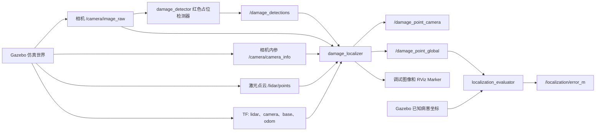

# Metro Inspection ROS 2 源码说明
终端 1：启动系统
先清理残留进程：
pkill -f gzserver || true
pkill -f gzclient || true
pkill -f damage_detector || true
pkill -f damage_localizer || true
pkill -f localization_evaluator || true
pkill -f damage_semantic_mapper || true
pkill -f robot_state_publisher || true
然后重新编译并启动：
cd /home/yang/metro-inspection/ros_ws
source /opt/ros/humble/setup.bash
colcon build --symlink-install --packages-select metro_closed_loop metro_localization
source install/setup.bash
ros2 launch metro_closed_loop closed_loop.launch.py gui:=true rviz:=true auto_drive:=false
查看三维坐标
ros2 topic echo --no-daemon /damage_point_global
查看里程、环号、时钟方位 JSON
ros2 topic echo --no-daemon /damage_semantic_result

本目录是 `metro-inspection` 项目的 ROS 2 源码目录，目前用于验证“相机病害检测 + 激光雷达点云 + TF 坐标变换 + 三维病害定位”的最小闭环。

当前实现基于：

- Ubuntu 22.04
- ROS 2 Humble
- Gazebo Classic / `gazebo_ros`
- Python 3.10
- OpenCV、NumPy
- `vision_msgs`、`sensor_msgs`、`geometry_msgs`、TF2

> 当前的红色病害检测器和 Gazebo 墙面均为验证算法链路的占位实现，不代表最终真实病害检测模型或实际地铁隧道环境。

## 1. 当前功能包

```text
src/
├── README.md
├── metro_closed_loop/       # Gazebo 闭环仿真、传感器和红色占位检测器
│   ├── launch/
│   ├── metro_closed_loop/
│   ├── rviz/
│   ├── urdf/
│   └── worlds/
└── metro_localization/           # 图像与点云融合、三维定位和误差评价
    ├── config/
    ├── launch/
    ├── metro_localization/
    └── test/
```

| 功能包 | 作用 |
|---|---|
| `metro_closed_loop` | 启动 Gazebo、生成巡检小车、发布相机和激光雷达数据、识别红色占位病害、自动驾驶及复位仿真 |
| `metro_localization` | 将点云投影到相机图像，在检测框内筛选点云，计算病害三维坐标，转换到全局坐标并评价定位误差 |

当前目录中**没有** `metro_detection` 功能包。真实 YOLO 或分割检测节点尚未接入，现阶段由 `damage_detector` 代替。

## 2. 系统数据流



三维定位的主要步骤为：

1. 接收时间接近的二维检测结果、激光点云和相机图像；
2. 使用 TF 将雷达点云转换到相机光学坐标系；
3. 使用 `/camera/camera_info` 中的相机内参将三维点投影到图像；
4. 在二维病害框的中心 ROI 内筛选对应点云；
5. 使用深度中位数和 MAD 方法剔除异常点；
6. 计算病害在相机坐标系中的三维坐标；
7. 再通过 TF 转换到 `odom` 全局坐标系；
8. 与 Gazebo 中已知的病害真值比较并输出欧氏距离误差。

## 3. 环境与依赖

首先加载 ROS 2 Humble：

```bash
source /opt/ros/humble/setup.bash
```

推荐使用 `rosdep` 根据两个功能包的 `package.xml` 安装依赖：

```bash
cd /home/yang/metro-inspection
sudo rosdep init        # 仅第一次使用 rosdep 时执行
rosdep update
rosdep install --from-paths src --ignore-src -r -y
```

主要运行依赖包括：

- `gazebo_ros`、`gazebo_msgs`
- `robot_state_publisher`、`xacro`
- `rclpy`
- `cv_bridge`
- `message_filters`
- `tf2_ros`
- `sensor_msgs_py`
- `vision_msgs`
- `visualization_msgs`
- `rviz2`
- NumPy、OpenCV

## 4. 编译

在项目根目录执行：

```bash
cd /home/yang/metro-inspection
source /opt/ros/humble/setup.bash

colcon build --symlink-install \
  --packages-select metro_localization metro_closed_loop

source install/setup.bash
```

每次打开新终端后都需要加载环境：

```bash
source /opt/ros/humble/setup.bash
source /home/yang/metro-inspection/install/setup.bash
```

如果修改了 Python 节点，使用 `--symlink-install` 时通常不需要重复复制源码；如果修改了 launch、URDF、world、RViz 或配置文件，建议重新执行一次构建。

## 5. 快速启动

### 5.1 静态闭环验证（推荐先运行）

```bash
ros2 launch metro_closed_loop closed_loop.launch.py auto_drive:=false
```

该命令会依次启动：

1. Gazebo 测试世界；
2. `robot_state_publisher`；
3. 仿真巡检小车；
4. 相机和 16 线模拟激光雷达；
5. 红色病害占位检测器；
6. 三维定位节点；
7. 定位误差评价节点；
8. RViz 调试界面。

建议先在小车静止状态下检查图像、点云、检测框和定位误差是否正确。

### 5.2 自动行驶验证

```bash
ros2 launch metro_closed_loop closed_loop.launch.py auto_drive:=true
```

默认在启动约 9 秒后发布：

- 线速度：`0.08 m/s`
- 角速度：`0.0 rad/s`

也可以覆盖启动参数：

```bash
ros2 launch metro_closed_loop closed_loop.launch.py \
  auto_drive:=true \
  auto_drive_delay:=9.0 \
  auto_linear_x:=0.08 \
  auto_angular_z:=0.0
```

当 `auto_angular_z` 非零时，自动驾驶节点会按正弦规律改变角速度。

### 5.3 无图形界面运行

服务器或仅验证话题时，可以关闭 Gazebo GUI 和 RViz：

```bash
ros2 launch metro_closed_loop closed_loop.launch.py \
  gui:=false rviz:=false auto_drive:=false
```

### 5.4 只启动定位算法

如果相机、点云、检测结果和 TF 已由其他设备、数据集或 rosbag 提供：

```bash
ros2 launch metro_localization localization.launch.py
```

不运行误差评价节点：

```bash
ros2 launch metro_localization localization.launch.py run_evaluator:=false
```

## 6. 闭环启动参数

`closed_loop.launch.py` 支持以下参数：

| 参数 | 默认值 | 说明 |
|---|---:|---|
| `use_sim_time` | `true` | 使用 Gazebo `/clock` 仿真时间 |
| `auto_drive` | `false` | 是否启动自动驾驶节点 |
| `auto_drive_delay` | `9.0` | 自动驾驶启动前的等待时间，单位秒 |
| `auto_linear_x` | `0.08` | 自动驾驶线速度，单位 m/s |
| `auto_angular_z` | `0.0` | 正弦角速度幅值，单位 rad/s |
| `rviz` | `true` | 是否启动 RViz |
| `gui` | `true` | 是否显示 Gazebo GUI |

启动时序为：

- Gazebo 和状态发布器：立即启动；
- 小车生成：约 2 秒后；
- 检测、定位、评价和 RViz：约 4 秒后；
- 自动驾驶：由 `auto_drive_delay` 决定，默认约 9 秒后。

## 7. 主要节点

| 节点/可执行程序 | 功能 |
|---|---|
| `damage_detector` | 对相机图像进行红色区域分割，发布标准 `Detection2DArray` |
| `auto_driver` | 周期性向 `/cmd_vel` 发布速度命令 |
| `reset_closed_loop` | 停止小车、复位 Gazebo 世界并将小车放回初始位置 |
| `damage_localizer` | 完成点云投影、ROI 点选择、稳健三维坐标估计及全局坐标变换 |
| `localization_evaluator` | 将定位结果与已知 Gazebo 真值比较并发布误差 |

## 8. 主要 ROS 话题

| 话题 | 消息类型 | 生产者 | 用途 |
|---|---|---|---|
| `/camera/image_raw` | `sensor_msgs/msg/Image` | Gazebo 相机 | 检测和可视化输入 |
| `/camera/camera_info` | `sensor_msgs/msg/CameraInfo` | Gazebo 相机 | 相机内参 |
| `/lidar/points` | `sensor_msgs/msg/PointCloud2` | Gazebo 雷达 | 三维点云输入 |
| `/damage_detections` | `vision_msgs/msg/Detection2DArray` | `damage_detector` | 二维病害检测框 |
| `/damage_point_camera` | `geometry_msgs/msg/PointStamped` | `damage_localizer` | 相机坐标系中的病害三维点 |
| `/damage_point_global` | `geometry_msgs/msg/PointStamped` | `damage_localizer` | `odom` 坐标系中的病害三维点 |
| `/localization/debug_projection` | `sensor_msgs/msg/Image` | `damage_localizer` | 点云投影和 ROI 调试图像 |
| `/localization/estimated_marker` | `visualization_msgs/msg/Marker` | `damage_localizer` | RViz 中的估计位置标记 |
| `/damage_ground_truth` | `geometry_msgs/msg/PointStamped` | `localization_evaluator` | Gazebo 病害真值 |
| `/localization/truth_marker` | `visualization_msgs/msg/Marker` | `localization_evaluator` | RViz 中的真值标记 |
| `/localization/error_m` | `std_msgs/msg/Float64` | `localization_evaluator` | 定位欧氏距离误差，单位米 |
| `/cmd_vel` | `geometry_msgs/msg/Twist` | `auto_driver` 或人工控制节点 | 小车速度命令 |
| `/odom` | `nav_msgs/msg/Odometry` | Gazebo 差速驱动插件 | 小车里程计 |
| `/tf` | `tf2_msgs/msg/TFMessage` | 状态发布器和 Gazebo 插件 | 坐标变换 |

常用检查命令：

```bash
ros2 topic list
ros2 topic hz /camera/image_raw
ros2 topic hz /lidar/points
ros2 topic echo /damage_detections
ros2 topic echo /damage_point_camera
ros2 topic echo /damage_point_global
ros2 topic echo /localization/error_m
```

`ros2 topic echo` 会等待下一条消息。如果检测器没有检测到红色区域，或者点云、相机、检测结果的时间戳无法同步，对应输出话题可能暂时没有消息。

## 9. RViz 调试颜色

默认 RViz 配置位于：

```text
metro_closed_loop/rviz/closed_loop.rviz
```

`Fusion Debug` 图像中的主要标记为：

- 绿色点：投影到图像范围内的激光点；
- 蓝色框：二维病害检测框；
- 黄色点：检测框 ROI 内被选中的点；
- 红色十字：最终估计的三维点重新投影到图像的位置。

建议按照“完整投影点 → 检测框 → ROI 点 → 三维估计点”的顺序排查问题。

## 10. 定位参数

定位配置文件：

```text
metro_localization/config/localization.yaml
```

关键参数：

| 参数 | 默认值 | 说明 |
|---|---:|---|
| `global_frame` | `odom` | 输出三维点使用的全局坐标系 |
| `sync_queue_size` | `20` | 图像、点云和检测结果的同步队列长度 |
| `sync_slop_sec` | `0.08` | 近似时间同步允许的最大时间差，单位秒 |
| `roi_scale` | `0.75` | 在检测框中心缩小后的点云选择区域比例 |
| `min_roi_points` | `4` | 完成三维估计所需的最少 ROI 点数 |
| `max_depth_deviation_m` | `0.08` | 基础深度离群阈值，单位米 |
| `max_debug_points` | `1800` | 调试图像最多绘制的投影点数 |
| `truth_xyz` | `[2.96, -0.18, 0.65]` | 仿真病害在 `odom` 中的已知真值 |

如果车辆运动后经常没有定位输出，可优先检查：

1. 检测框内是否还有雷达点；
2. `sync_slop_sec` 是否过小；
3. 雷达、相机和检测消息是否使用一致的仿真时间；
4. `lidar_link` 到 `camera_optical_frame` 的 TF 是否存在；
5. `odom` 到相机坐标系的 TF 是否可查询。

## 11. 复位仿真

闭环正在运行时，可在另一个已加载工作空间环境的终端执行：

```bash
ros2 run metro_closed_loop reset_closed_loop
```

该命令会：

1. 向 `/cmd_vel` 发布零速度；
2. 调用 Gazebo `/reset_world`；
3. 将 `inspection_car` 放回世界坐标约 `(0, 0, 0.12)`；
4. 保持自动驾驶停止状态。

复位后如需继续自动行驶，需要重新启动 `auto_driver` 或重新运行 launch。

## 12. 运行测试

当前 `metro_localization` 包包含几何变换、相机投影、检测框点选择和异常深度剔除测试。

```bash
cd /home/yang/metro-inspection
source /opt/ros/humble/setup.bash
source install/setup.bash

colcon test --packages-select metro_localization
colcon test-result --verbose
```

也可以直接运行 Python 测试：

```bash
pytest -q src/metro_localization/test/test_geometry.py
```

## 13. 接入真实检测模型

`damage_detector` 只负责识别 Gazebo 中的红色占位块。接入 YOLO、实例分割或其他真实病害检测模型时，需要让真实检测节点：

1. 订阅 `/camera/image_raw` 或等价图像话题；
2. 发布 `vision_msgs/msg/Detection2DArray` 到 `/damage_detections`；
3. 将输出消息的 `header` 与源图像的 `header` 保持一致；
4. 正确填写检测框中心和宽高；
5. 不向定位节点伪造单目深度，三维距离应由点云融合计算；
6. 如修改话题名称，同步修改 `localization.yaml`。

因此，后续的真实检测包只要保持上述接口，通常不需要修改 `metro_localization` 的核心算法。

## 14. 当前限制

- Gazebo 场景是简化平面、墙面和红色病害块，不是完整地铁隧道；
- 红色检测器是颜色分割占位程序，不具备真实病害识别能力；
- 病害真值坐标写在配置文件中，仅适用于当前仿真场景；
- 当前主要验证单个可见病害目标的图像—点云定位链路；
- 尚未接入真实相机标定文件、真实雷达外参、数据集或 rosbag；
- 尚未包含正式的 `metro_detection`、导航、建图和巡检报告模块；
- 切换到真实机器人后，需要重新标定雷达到相机的外参，并确认所有消息时间同步。

## 15. 开发建议

推荐按以下顺序扩展：

1. 保持当前静态仿真闭环稳定；
2. 验证车辆运动时的同步、TF 和定位误差；
3. 用真实 YOLO/分割节点替换 `damage_detector`；
4. 使用 rosbag 回放真实图像和点云；
5. 接入真实相机内参和雷达—相机外参；
6. 增加多目标跟踪、病害去重和轨迹关联；
7. 接入导航、建图和巡检报告模块。

---

最后更新：2026-07-20